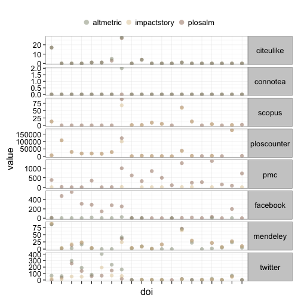

opts_chunk$set(warning=FALSE, message=FALSE, comment=NA, cache=FALSE, tidy=FALSE, warning=FALSE)


# Consuming altmetrics: some observations and lessons

### Authors: Scott A. Chamberlain

+ Scott A. Chamberlain ([scott@ropensci.org](mailto:scott@ropensci.org)), Biology Dept., Simon Fraser University, Burnaby, BC, Canada V5B 1E1

Abstract
--------

XXXX

Introduction
--------

Altmetrics, or article level metrics, measure the impact of individual articles, or objects. This is in stark contrast to the impact factor, which is a proprietary summation of the impact of all articles in a journal. Altmetrics have many advantages over journal level metrics, including quantifying more than just citations, and providing metrics on a variety of impacts (e.g., discussed by the media (mentions in the news), discussed by the public (facebook likes, tweets), and importance to colleagues (citations)). 

Altmetrics can be consumed in a variety of contexts: as static text, images, or graphs alongside a pdf or html page, as a javascript widget in an html page, and more. A use case that will, and should, be increasingly common is using scripting languages (e.g., Python, Ruby, R) to consume altmetrics on a machine locally, often for purposes of research on altmetrics themselves. Consuming altmetrics from this perspective is somewhat different than the typical use case where a user looks at altmetrics in a web browser. 

This paper takes a look at the perspective of developing and using scripting interfaces to altmetrics. From this perspective, there are a number of considerations: data stanardization and consistency; API speed; authentication; and data provenance. First, I'll go over the current altmetrics data providers. 

Altmetrics data providers
--------

There are many publishers that are now presenting altmetrics alongside their papers on their websites. However, these publishers do not yet provide public facing APIs (Application Programming Interface) at the time of writing. There are four entities that aggreagate and provide altmetrics data, one of which (Plum Analytics) does not have an open public facing API, so will not be discussed further.  Three altmetrics providers, PLoS, ImpactStory, and Altmetric, are similar in some ways, and different in others. PLoS and ImpactStory have open APIs, while Altmetrics API is limited to X API requests per X. PLoS provides data in JSON (JavaScript Object Notation) and XML (Extensible Metadata Language), ImpactStory in JSON only, and Altmetric in JSON and JSONP. In terms of granularity, PLoS provides much more granular data than the others, with daily, monthly and yearly totals; ImpactStory provides only total values; and Altmetric provides total values, plus incremental summaries of their proprietary Altmetric score. PLoS is a publisher, while the mission of the other two is to collect and provide altmetrics data. PLoS and ImpactStory are non-profit, while Altmetric is for-profit.

The three providers overlap in some sources of altmetrics they gather, but not all. The fact that there is some complementarity in sources opens the possibility that metrics can be combined from across the different providers. For those that are compelementary, this should be relatively easy. However, when they share data sources, data may not be consistent between providers for the same data source (see _Data standardization and consistency_ below).

Table 1. Details on the current altmetrics providers.

Variable               | PLoS      | ImpactStory          | Altmetric |
---------------------- | --------- | -------------------- | --------- |
Open API?              | Yes       | Yes                  | Limited   |
Data format            | JSON,XML  | JSON                 | JSON,JSONP|
Granularity[^1]        | D,M,Y     | T                    | I         |
Authentication         | None      | API key              | API key   |
Business type| Publisher | Altmetrics provider  | Altmetrics provider   |
Business model         | Non-profit| Non-profit    | For-profit   |

[^1]: D: day; M: month; Y: year; T: total; I: incremental summaries


Data standardization and consistency
--------

Now that there are multiple providers for altmetrics data, data consistency is something to keep in mind. For example, PLoS, ImpactStory and Altmetric do collect altmetrics from some of the same data sources. Are the numbers they present to users the same for the same paper, or are they different due to different collection dates or methods of collection? Each of the three providers of course has the right to collect metrics as needed for their purposes, 

I retrieved a set of 100 more or less random DOIs for full articles from PLoS journals - this way all three providers would have data on the papers. I collected metrics from each of the three providers for each of the 100 DOIs. 


```
## Loading required package: bitops
```

<figure><figcaption>Fig. 1. A comparison of eight different altmetrics on a set of 20 DOIs from Altmetric, ImpactStory, and PLoS.</figcaption></figure>


### A crosswalk among providers

As discussed above, when similar data sources are collected by altmetrics providers, ideally, there would be a way to go between, for example, data from Twitter for PLoS, ImpactStory, and Altmetric. Each of the three providers of course has the right to collect metrics as needed for their purposes, but as altmetrics consumers, we should be able to compare data from the same source across providers. In Appendix Table A1, I provide a table to crosswalk metrics for the same data source among providers.

API Speed
--------

The speed of API calls is not likely something most users for altmetrics providers will notice. However, developers of applications on top of altmetrics providers will definitely notice differences in API speed. A quick analysis of the speed of API requests shows that PLoS is about twice as fast as Altmetric, and ImpactStory is many times slower than both PLoS and Altmetric. 


```r
# This test was done using a MacBook Pro, mid-2010, 4 core machine, 2.5
# GHz Intel processor
library(rbenchmark)

# Run the benchmark tests
benchmark(replications = 3, PLoS = alm(doi = dois[10], total_details = TRUE), 
    Altmetric = altmetrics(doi = dois[10]), ImpactStory = metrics(dois[10]), 
    order = "elapsed", columns = c("test", "elapsed", "replications"))
```

```
##          test elapsed replications
## 1        PLoS   0.562            3
## 2   Altmetric   1.351            3
## 3 ImpactStory   1.828            3
```


Another aspect of API speed is the ability to pass in many queries simultaneously. The PLoS API allows you to pass in many DOIs or other identifiers to retrieve altmetrics, whereas the Altmetric and ImpactStory APIs only allow one identifier per call. Allowing many identifiers per call can dramatically speed up altmetrics harvesting. Another option to speed up calls is parallelizing calls across cores of a machine or many machines.  However, this will cause many calls in a very short time period, likely violating the rules/guidelines issued by the providers.


Authentication
--------

There are a variety of possible authentication methods, some of which include: a) no authentication, b) username and password pair, c) API key, and d) OAuth (including OAuth1 and OAuth2) (Table 1). These different options make sense in different use cases. The first, no authentication, used by PLoS, makes sense when an API first comes out and testers are needed to get feedback on the API. A benefit of an API with no authentication is the barrier to entry is lower. That is, if you don't have to ask a user to register to get an API key they are more likely to use the API. The second and third options, username/password pair and API key are relatively similar; API keys are used by both ImpactStory and Altmetric (Table 1). The last option, OAuth, is not used by any of the altmetrics providers. This authentication method is however used by many API providers. From the viewpoint of a consumer in a desktop scripting language, OAuth can be painful. What works better for scripting languages are the first three options.  

Data provenance
--------

Data for the same altmetrics resource could be calculated in different ways and collected at different times for the same object. The three providers already provide the date the metrics were updated. However, there is no information available, via their APIs at least, regarding how data were collected, and what, if any, calculations were done on the data before providing the data. The for-profit providers, Altmetric and Plum Analytics, have no obligation to share these, but the altmetrics community overall would benefit from transparency in how data are collected. 

Conclusion
--------

XXXXXX

Acknowledgments
--------

I thank Martin Fenner for inviting me to write a paper in this special issue, and for feedback from X, Y, and Z on earlier versions of this manuscript.

References
--------

Appendix A. Crosswalk table among providers.
--------

The following Table A1 provides a crosswalk between altmetrics data collected by the three data providers. Note that these variables relate to one another across providers, but the data may be collected differently, and so for example, altmetrics collected for Twitter may differ between PLoS, ImpactStory and Altmetric.  

Table A1. Crosswalk table among data sources among different providers.

Data source | PLoS[^2]    | ImpactStory[^3] | Altmetric[^4]   |
----------- | ----------- | ----------- | ----------- |
Biod | biod | No | No |
Connotea | connotea | No | No |
General blogs | bloglines | No | No |
Nature blogs | nature | No | No |
Postgenomic | postgenomic | No | No |
Researchblogging | researchblogging | No | No |
WebOfScience citations | webofscience | No | No |
Dryad | No | dryad:total_downloads/package_views | No |
Figshare | No | figshare:views shares downloads | No |
Github | No | github:forks stars | No |
PLoS Search | No | plossearch:mentions | No |
Slideshare | No | slideshare:favorites views comments downloads | No |
Google+ | No | No | cited_by_gplus_count |
MSM | No | No | cited_by_msm_count |
News articles | No | No | Yes |
Reddit | No | No | cited_by_rdts_count |
Citeulike | citeulike | citeulike:bookmarks | No |
Crossref | crossref | plosalm:crossref[^5] | No |
PLoS ALM | counter:pdf_views html_views xml_views | plosalm:html_views pdf_views | No |
PMC | pmc | pmc:suppdata_views figure_views unique_ip_views pdf_downloads abstract_views fulltext_views; (plosalm:pmc_abstract pmc_supp-data pmc_figure pmc_full-text pmc_pdf pmc_unique-ip)[^5] | No |
PubMed | pubmed | pubmed:pmc_citations_reviews f1000 pmc_citations_editorials pmc_citations (plosalm:pubmed_central)[^5] | No |
Scienceseeker | scienceseeker | scienceseeker:blog_posts | No |
Scopus citations | scopus | scopus:citations; (plosalm:scopus)[^5] | No |
Wikipedia | wikipedia | wikipedia:mentions | No |
Delicious | No | delicious:bookmarks | cited_by_delicious_count |
Facebook | facebook | facebook:shares clicks comments likes | cited_by_fbwalls_count |
Mendeley | mendeley | mendeley:discipline readers groups country career_stage | mendeley |
Twitter | twitter | topsy:influential_tweets tweets | cited_by_tweeters_count |

Here is an example of calling the API of each the three providers to combine data from different sources.


```r
(out <- compare_altmet_prov(doi = "10.1371/journal.pone.0018657"))
```

```
##      provider                          doi citeulike connotea scopus
## 1     plosalm 10.1371/journal.pone.0018657        17        0     13
## 2   altmetric 10.1371/journal.pone.0018657        17        0     NA
## 3 impactstory 10.1371/journal.pone.0018657        NA       NA     13
##   ploscounter pmc facebook mendeley twitter date_modified
## 1        6681 380        7       87       0    2013-05-10
## 2          NA  NA        1       86      68    2012-11-14
## 3        6497   3       NA       91      22    2013-04-24
```


[^2]: These are the exact names for each data source in the PLos ALM API. For example: http://alm.plos.org/api/v3/articles?ids=10.1371/journal.pone.0018657&source=twitter

[^3]: You can not request a specific source from the ImpactStory API, so these are the names of the fields in the returned json. For example, see the json from this call: http://api.impactstory.org/v1/item/doi/10.1371/journal.pone.0018657?key=YOURAPIKEY

[^4]: You can not request a specific source from the Altmetric API, so these are the names of the fields in the returned json. For example, see the json from this call: http://api.altmetric.com/v1/doi/10.1371/journal.pbio.0018657?key=YOURAPIKEY

[^5]: Collected from the PLoS ALM API.
